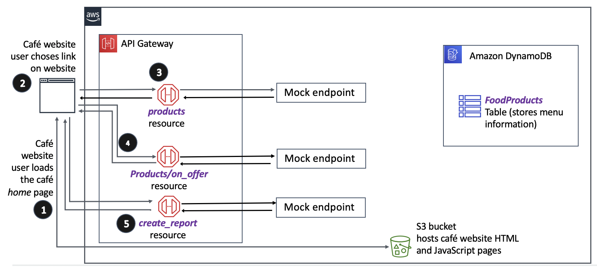
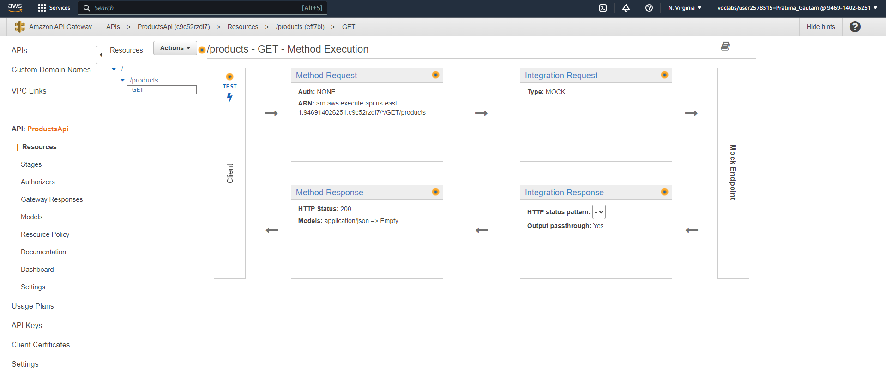
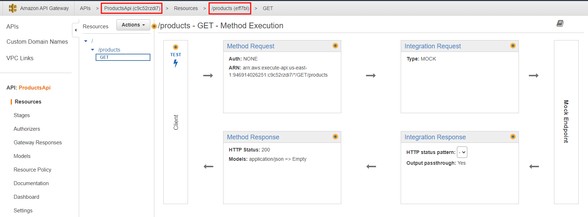
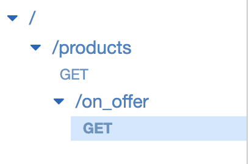
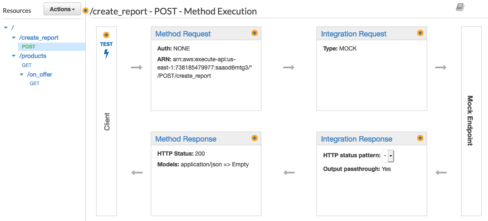
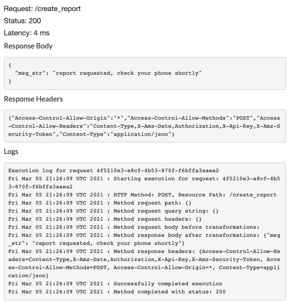
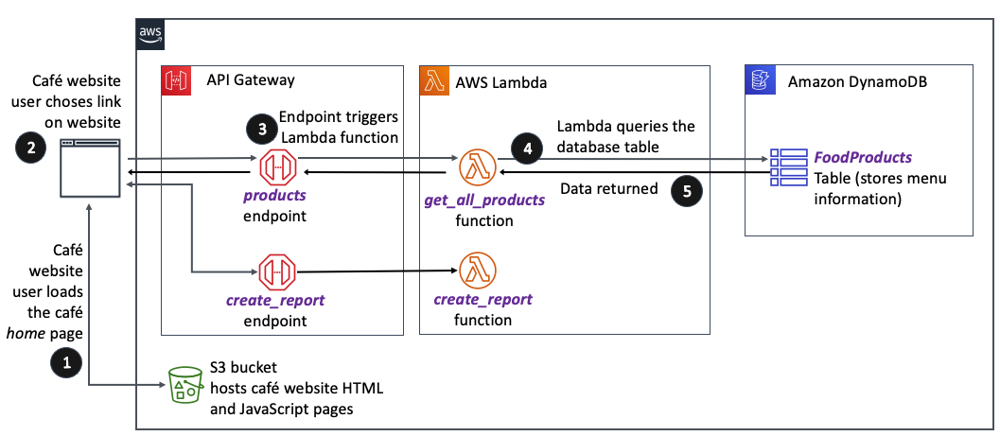

# Developing-REST-APIs-with-API-Gateway

Architecture to Design



## Task 1: Preparing the development environment

1. Run the given command to download and extract the files for this lab.

    ```bash
    wget https://aws-tc-largeobjects.s3.us-west-2.amazonaws.com/CUR-TF-200-ACCDEV-2/lab-04-api/code.zip -P /home/ec2-user/environment
    ```

    To Unzip:

    ```bash
    unzip code.zip
    ```

2. Run the script to upgrade version of Python and AWS CLI

    ```bash
    chmod +x resources/setup.sh && resources/setup.sh
    ```

    It prompts for an **IP Address** by which our computer is known to the internet. We use [WhatIsMyIP](http://www.whatismyip.com/) to discover the IP address and paste the IPV4 address in the prompt.

3. Verifying the AWS version and SDK for python.

    ```bash
    aws --version
    ```

    ```bash
    pip show boto3
    ```

4. Copy the `Object URL` of the `index.html` file from the S3 bucket and paste it in the browser to verify the setup.

    ```text
    https://<bucket-name>.s3.amazon.com/index.html
    ```

    The menu items displayed on the website are currently being read out of the `all_products_on_offer.json` and `all_products.json` files that are hosted in our S3 bucket. Copy of these files are located in the `resources/website` directory.

## Task 2: Creating the first API endpoint (GET)

Here, we will create a REST API called `ProductsApi` and create the first of three resources for the API. The first API resource will be called `products`. It will make a GET request so that the website can retrieve all rows from the `FoodProducts` DynamoDB database table. We will then deploy it in an API Gateway stage that's named `prod`. When a user visits the website, it will make an AJAX request and return a list of café menu items from API gateway (it will return mock data for now).

1. Expand the `python_3` directory and open the file named `create_products_api.py`. [SDK for Python documentation](https://boto3.amazonaws.com/v1/documentation/api/latest/reference/services/apigateway.html). On line 3, replace the  (fill me in) with the correct value that will create an API Gateway client.

    ```python
    client = boto3.client('apigateway', region_name='us-east-1')
    ```

    `Lines 5-24` create a REST API that's named ProductsApi, and a resource that's named products.

    `Lines 28-33` create a method request of type GET in the products resource.

2. Save the changes to the file and run the code.

    ```bash
    cd python_3
    python create_products_api.py
    ```

3. Return to the `AWS Management Console`, open the API Gateway console. Open the `ProductsApi` API and verify that the `products` resource has been created. Choose the `GET` method and verify that the `Method Request` section has been configured. See the details of the GET method execution in a graphical format.

    

    On the left is the Client.
    `Lines 28-33` - When you run the Test, the Method Request is sent to the URL in the Amazon Resource Name (ARN) detail. The request doesn't require any authorization to invoke it.

    `Lines 50-58` - The Integration Request of type MOCK is invoked, and the mock endpoint receives the data.

    `Lines 35-48` - The mock endpoint invokes the Integration Response, which invokes the Method Response.

    `Lines 61-92` - The Method Response returns the REST API response back to the Client that the request originated from.

    **Note**: attributes in DynamoDB are not primatives. Instead, they are `wrapper objects` (as shown in the example code below). This is why there is a slight difference between the key names in the JSON and the attribute names in DynamoDB.

    ```json
    product_name: {
    "S": "vanilla cupcake"
    }```

4. In the API Gateway console, choose the  `TEST` link, then scroll to the bottom and choose the `Test` button. In the panel on the right, we will see the following response body, response headers, and log information.

    ```code
    [
        {
            "product_name_str": "apple pie slice",
            "product_id_str": "a444",
            "price_in_cents_int": 595,
            "description_str": "amazing taste",
            "tag_str_arr": [
            "pie slice",
            "on offer"
            ],
            "special_int": 1
        },
        {
            "product_name_str": "chocolate cake slice",
            "product_id_str": "a445",
            "price_in_cents_int": 595,
            "description_str": "chocolate heaven",
            "tag_str_arr": [
            "cake slice",
            "on offer"
            ]
        },
        {
            "product_name_str": "chocolate cake",
            "product_id_str": "a446",
            "price_in_cents_int": 4095,
            "description_str": "chocolate heaven",
            "tag_str_arr": [
            "whole cake",
            "on offer"
            ]
        }
    ]```

    Here, we created and tested a REST API with a resource that makes a GET request.

## Task 3: Creating the second API endpoint (GET)

We will define another endpoint of type GET to support calls to `/products/on_offer`. This endpoint will return a list of products that are currently on offer.

1. Expand the `python_3` directory and open the file named `create_on_offer_api.py`. Replace <FMI_1> and <FMI_2> with the correct values so that this code file will add another resource to the API that we defined in the previous task.

    In the breadcrumb navigation at the top of the screen (above the Actions menu), we can see `APIs >  ProductsAPI` followed by an id in parenthesis.  

    This is the `api_id`.
    On the same line,  we will see `/products`, followed by another id in parenthesis.  

    This is the resource `parent_id`

    

2. Create the API resource by saving the changes to the file. Then in the Bash terminal, verify that the current directory is python_3 and run the code.

    ```bash
    python create_on_offer_api.py
    ```

3. Return to the `AWS Management Console`, open the API Gateway console. Open the `ProductsApi` API and verify that the `on_offer` resource has been created. Choose the `GET` method and verify that the `Method Request` section has been configured. See the details of the GET method execution in a graphical format. Likewise, click on the `Test` link and verify that the response body contains the correct data.

    

    We should receive `200` HTML status code response while testing the `/on_offer` resource.

    ```json
    [
        {
            "product_name_str": "apple pie slice",
            "product_id_str": "a444",
            "price_in_cents_int": 595,
            "description_str": "amazing taste",
            "tag_str_arr": [
            "pie slice",
            "on offer"
            ],
            "special_int": 1
        }
    ]
    ```

    We have now two API resources the website will be able to use.

## Task 4: Creating the third API endpoint (POST)

We will create a third resource for the API,  `/create_report`. This resource will be configured at the same level as /products (not as a nested resource under products).

Analyze and update the `create_report_api.py` code. Replace the <FMI_1> that appears on line 5 with the correct value. Use the following code to find the API ID and replace the <FMI_1> value with the correct value.

```bash
aws apigateway get-rest-apis --query items[0].id --output text
```

Analyze the rest of the `create_report_api` code while comparing it to the `create_products_api` code. The code in the two files looks similar, but they have some differences:

- The `httpMethod` that's invoked is POST (instead of GET).

- This code creates a new resource with a `pathPart` of `create_report`, instead of products.

- The `product_integration_response` defines **three** responseParameters. In `create_report_api` these parameters do not allow **Cross-Origin Resource Sharing** (CORS), whereas in `create_products_api` they do allow it.

- The `product_integration_response` also hardcodes a response for testing purposes, though the user is not authenticated. (The purpose of the test is to ensure that the client can receive a response.)

    ```json
    {
    "msg_str": "report requested, check your phone shortly"
    }
    ```

    **Save** the changes to the file and run the code.

    ```bash
    python create_report_api.py
    ```

    Return to the **API Management Console**, Confirm that you are in `ProductsApi`. In the navigation pane, confirm that Resources is selected, and choose `/create_report > POST`.

    We should see the details of the POST method execution.

    

    Choose the  TEST link, then choose the Test button at the bottom of the screen. We should see the following response body, response headers, and log information.

    

## Task 5: Deploying the API

1. Deploy the API.

    Still in the API Gateway console where we have the ProductsApi details open, under `Resources` select the root /

    From the `Actions` menu, choose `Deploy API` and then fill in the details:.  
    - Deployment stage:  [`New Stage`].
    - Stage name: `prod`
    - Stage description: (leave blank)
    - Deployment description: (leave blank)

    Choose `Deploy` and copy the `Invoke URL` value that appears in the `Invoke URL` field. We will need this value in the next task.

    Invoke URL: [Invoke URL](https://c9c52rzdi7.execute-api.us-east-1.amazonaws.com/prod)

## Task 6: Updating the website to use the APIs

1. Open `resources/website/config.js`

    On line 2, replace `null` with the Invoke URL value you copied a moment ago. Be sure to surround it in quotes.

    ```javascript
    window.COFFEE_CONFIG = {
        API_GW_BASE_URL_STR: "https://c9c52rzdi7.execute-api.us-east-1.amazonaws.com/prod",
        COGNITO_LOGIN_BASE_URL_STR: null
    };
    ```

    Verify that  `prod` appears at the end of the URL with no trailing slash.

    `Save` the change to the file.

2. Update and then run the `update_config.py` script.

    Replace the <FMI_1> placeholder with the name of your bucket.

    To find the bucket name in the S3 console, run the following command

    ```bash
    aws s3 ls
    ```

    The `update_config.py` script will upload the `config.js` file to the S3 bucket.

    ```bash
    python update_config.py
    ```

    Load the website in the browser and verify that the website is working as expected.

**To-Do:**


